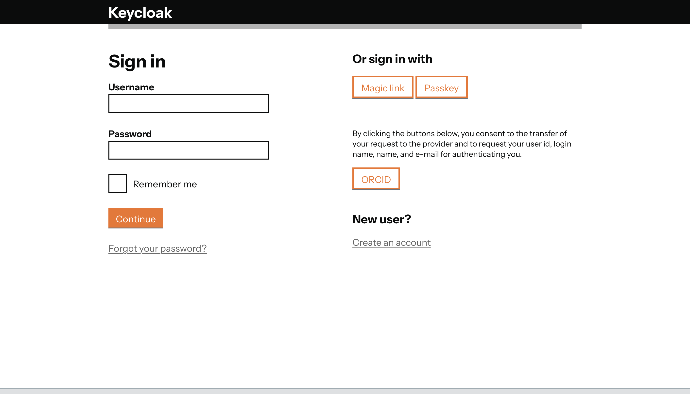
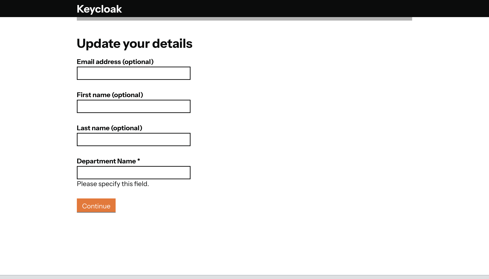

## Keycloak Theme hsgSocial

 

Built on [GOV.UK](https://github.com/UKHomeOffice/keycloak-theme-govuk) under 
[Open Government Licence v3](https://www.nationalarchives.gov.uk/doc/open-government-licence/version/3/). Crown copyright, UK Home Office.

Released under MIT License 

### Deployment 

Must set the following in [realm localization overrides](https://www.keycloak.org/ui-customization/localization#_overriding_localized_text_for_an_entire_realm): 

1. providerName
2. privacyPolicy
3. headerLink
4. providerLink

### Modifications

1. Added support for custom user profile attributes
2. Added support for update user details on login page
3. Added support for social logins

### License

keycloak-theme-hsgSocial is distributed under MIT License.
